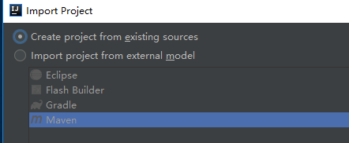

# Java（1）创建Maven项目

###前注

idea 直接创建 Maven 项目方法略，一般来说 idea 里 new Project 然后选择 Maven，一路向下就可以了。

这里解决的是将已有项目转为 Maven 项目的问题（记得先备份源代码）。

### 1、下载并配置Maven

首先下载 Maven

参照：https://blog.csdn.net/qq_32588349/article/details/51461182

一些解释：

* 解压可以用 7-zip
* 配置环境变量的时候，目录不能只写到 ``xx\apache-maven-3.5.4``，而是要写到 ``xx\apache-maven-3.5.4\bin``
* 写路径的那个环境变量（配M2_HOME和他的路径时），如果在 win10，记得要配在【系统变量】下，而不是配在【用户变量】

### 2、从一个空的github项目转为Maven

先在github创建一个空项目，然后 fork 到本地，然后 idea 会问你是否导入，此时选择第一个 【Create project from existing sources】，出来的是一个空目录。

右键根目录，选择 【add framework support】 ，然后选 maven，然后就很easy了。

如果没有，看下一步。

### 3、add framework support 没有 Maven 的解决方案

* 左上角 File-Project Structure，出现弹窗，
* 先删掉中间列表里的那一个（点击后，点减号）；
* 红框处下拉选 1.8（1.8版本的jdk，或者其他版本的应该也可以，没有的话去下一个，方法和配置略），然后点 apply。

* 然后左侧选 Modules，点击 加号 - New Module，
* 出弹窗选 Maven，点 next；
* GroupId 和 Artifactld 随便填（但必须填），点next；
* 修改目录，记得删掉路径最后的 Artifactld 的值（以及最后那个斜杠），然后第一行的 Module name 会出现你当前项目的名字，然后选择 Finish，他会提示你是否 overwrite，选确定，弹窗关闭。
* 然后点 OK。

此时工程目录变化为下图， 表示已经转为Maven项目了。

### 4、参考文献和一些备注

1、使用IntelliJ IDEA 配置Maven（入门）

https://blog.csdn.net/qq_32588349/article/details/51461182

2、利用IntelliJ IDEA与Maven开始你的Scala之旅：（参考他的第二步）

https://www.jianshu.com/p/ecc6eb298b8f

* GroupId，可以理解为用来标志你整个项目组的，或者你这些代码属于某一个完整的项目，比如上面的org.apache.spark就可以非常好的来标志Apache的Spark这个项目了。一般来说可以使用倒序的公司网址来作为GroupId，这可以类比为，沿袭了Java项目中使用倒序公司网址来作为Package名称的一个惯例。
* ArtifactId，一般是用来在整个项目组来标志本项目的，相比GroupId的范围，其概念要稍微小一些，比如spark-core_2.11就非常好的表示出了本项目主要是关于Spark的核心基础组件的，从而能够与Spark其他各种组件或架构很好的区分开来。
* Version，正如字面意思，就是本项目的迭代版本的信息，如上面的1.6.2.
