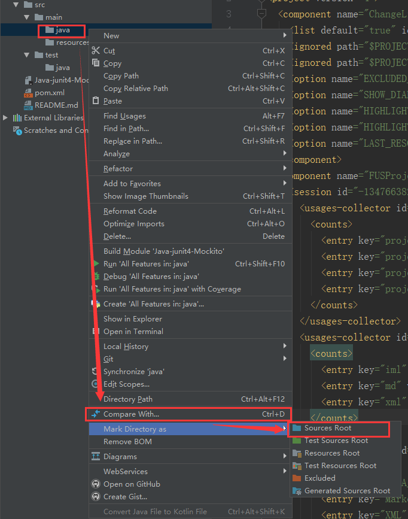
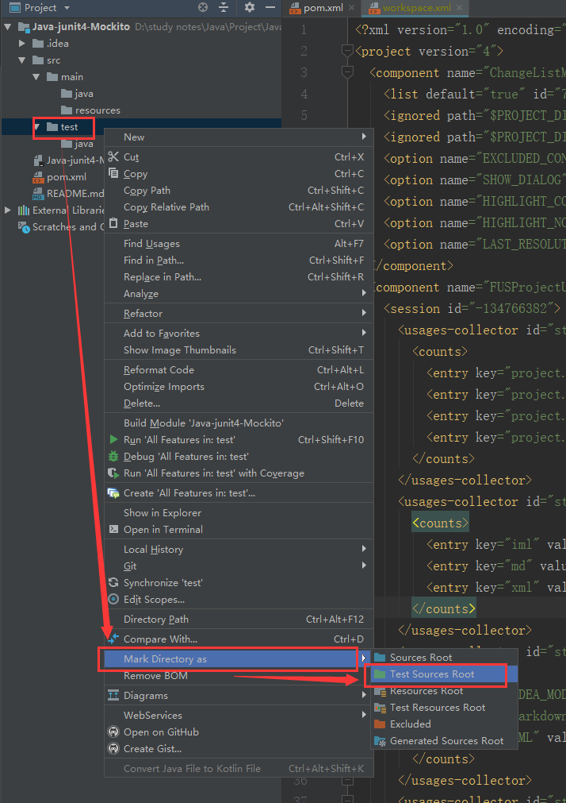
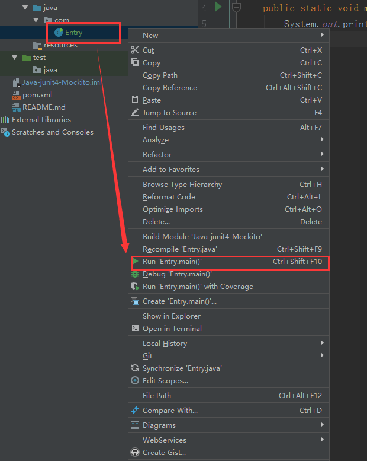
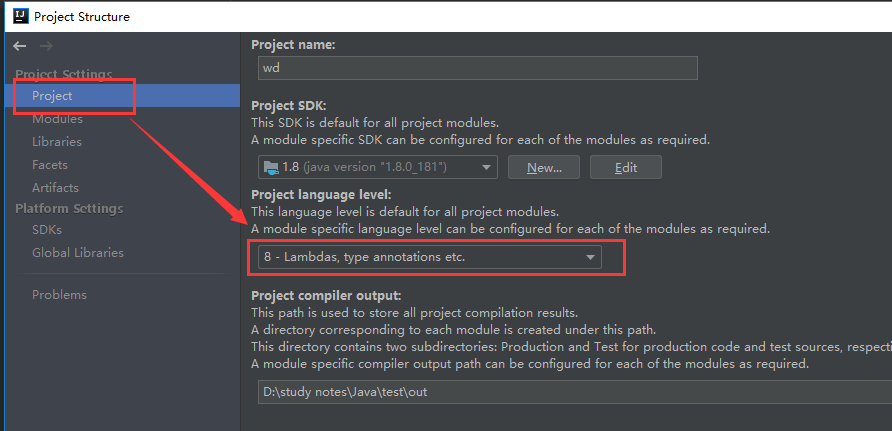

### 前注：

假设你已经创建好了 Maven 项目，哪怕是一个空的Maven项目，参照文章：

https://mp.csdn.net/postedit/81613171

### 1、设置目录

如图，设置 src/main/java 为 Sources Root（代码根目录）



设置 src/test目录为 Test Sources Root（单元测试根目录）



然后同理 src/main/resources 为第三个（资源根目录），图略。


### 2、创建 class 文件

右键 Java 文件夹，new - Package，名字写 com，表示这是一个package

再右键 com 文件夹，new - Java Class，名字填 Entry（随便写，这里示例表示这里是入口文件）

代码写：

```
package com;

public class Entry {
    public static void main(String[] args) {
        System.out.println("Hello world!");
    }
}
```

### 3、运行

如图运行



代码运行成功，出现 Hello world!

### 4、错误：无效的源发行版

如果提示 【无效的源发行版】，请参考这篇文章，

https://blog.csdn.net/qq_35981283/article/details/79915713

简单来说，就是 File - Project Structure ，进入下图，右边红框部分选 8。

