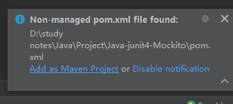
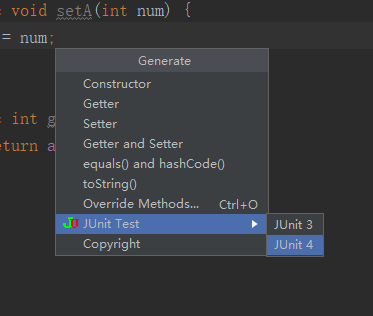
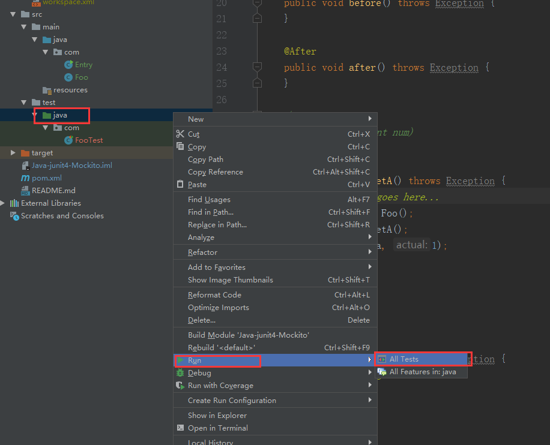
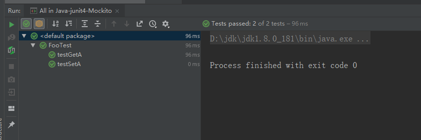

# 如何进行单元测试

### 1、下载、创建 Maven 项目，或将项目转为 Maven 项目

参考这篇文章：

https://blog.csdn.net/qq20004604/article/details/81613171

### 2、开始运行 Maven 项目

参考这篇文章：

https://blog.csdn.net/qq20004604/article/details/81613240

### 3、安装junit

参考这篇文章：

https://blog.csdn.net/anuocat/article/details/72811181

简单来说，就是 用 IDEA自带的 【JUnit插件】，再手动搜索安装 【JUnitGeneratorV2.0】

### 4、添加依赖

打开 pom.xml，在 ``<dependencies>`` 标签内添加下面 ``<dependencies>`` 里的 2 个``<dependency>``；

如果 ``<dependencies>`` 都没有，那么直接复制粘贴下面全部。（这句话虽然有点绕，但应该能看得懂）

```
<dependencies>
    <dependency>
        <groupId>org.mockito</groupId>
        <artifactId>mockito-all</artifactId>
        <version>1.9.5</version>
        <scope>test</scope>
    </dependency>
    <dependency>
        <groupId>junit</groupId>
        <artifactId>junit</artifactId>
        <version>4.11</version>
        <scope>test</scope>
    </dependency>
</dependencies>
```

一般来说，会自动安装，如果没自动安装的话，重启 idea 试试？或者自己搜索一下解决方法。

比如重启idea并打开工程后，提示下面，选左边的 Add as Maven Project



然后他就会自动下载了，等下载完毕。


### 5、创建被测试类和测试类

com 文件夹下创建 Foo.java，顺便附上一个现成可用的。

```
package com;

public class Foo {
    private int a = 1;

    public void setA(int num) {
        a = num;
    }

    public int getA() {
        return a;
    }
}
```

然后在这个文件里，按 alt + insert，选 JUnit Test - JUnit 4



于是会自动生成一个 FooTest.java 文件，并且里面填充了一些代码。

如果生成的文件报错，十有八九就是没有自动下载依赖，参考 【4】 里面的解决方案。

然后在前面引入 Mockito，代码如下：

```
import static org.mockito.Mockito.*;
import static org.junit.Assert.*;
```

另外，手动引很麻烦，不如改模板方便，改模板方法是：

File - Settings - Other Settings - JUnit Generator - JUnit 4 ，然后在里面改模板，把上面两个添加到 import 那三行之后，参考下面代码。

```
import org.junit.Test; 
import org.junit.Before; 
import org.junit.After; 

import static org.mockito.Mockito.*;
import static org.junit.Assert.*;
```

### 6、修改测试类代码

直接给出测试类代码：

```
package com;

import org.junit.Test;
import org.junit.Before;
import org.junit.After;

import static org.mockito.Mockito.*;
import static org.junit.Assert.*;

public class FooTest {

    @Before
    public void before() throws Exception {
    }

    @After
    public void after() throws Exception {
    }

    /**
     * Method: setA(int num)
     */
    @Test
    public void testSetA() throws Exception {
        Foo foo = new Foo();
        int a = foo.getA();
        assertEquals(a, 1);
    }

    /**
     * Method: getA()
     */
    @Test
    public void testGetA() throws Exception {
        // 这是常规 JUnit 的测试方法
        Foo foo = new Foo();
        foo.setA(3);
        int a = foo.getA();
        assertEquals(a, 3);

        // 这是 mockito 的测试方法
        Foo bar = mock(Foo.class);
        bar.setA(2);
        // 这一步验证是否被调用，并且参数是2，如果这里参数写3的话，就会报错
        verify(bar).setA(2);
    }
} 
```


### 7、运行测试

如图运行所有测试文件：



然后 idea 会自动跑测试代码，由于以上代码没问题，于是全部通过。如果想测试不通过的情况，可以修改上面的参数尝试，就可以查看错误信息是什么样子的了。

具体 JUnit 和 Mockito 怎么用，参考各个教程，这里略。



示例代码请查看这个项目：

https://github.com/qq20004604/Java-junit4-Mockito

### 8、参考文章：

安装：

https://blog.csdn.net/anuocat/article/details/72811181

验证：

https://www.cnblogs.com/Ming8006/p/6297333.html
